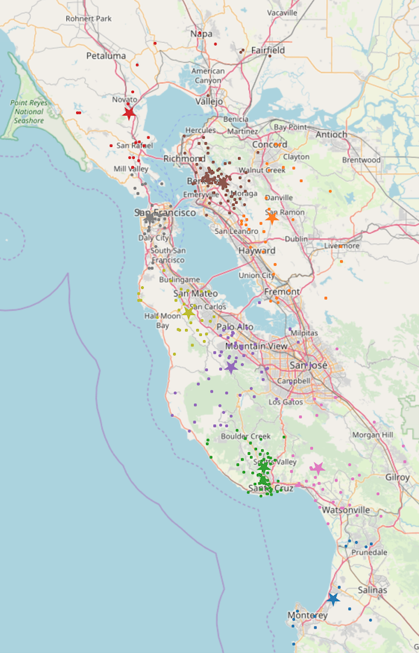

## Executive Summary
### Chris Huber, chrishubersf@gmail.com
#### A predictive study of edible wild mushroom growth in the greater San Francisco Bay Area

### Problem Statement and Goal

Given prior records of findings of edible wild edible mushroom species with latitude/longitude coordinates, species names, dates of sightings, weather conditions, and forest compositions can I predict for a given time period and location which species of edible mushroom it is among those that grow natively in the Bay Area?

### Data Sources

My main data source for the project is a MySQL database dump from Mushroom Observer, a user-submitted mushroom documenting website. I seperated those records into seperate Bay Area relevant tables using SQL and wrote queries to extract the data sets I was looking for with my chosen filters. I have also sourced weather data for the submitted periods (May 2006 - September 2018) from the NOAA weeather website. 

In terms of feature engineering, I created an artifical half mile square location grid and assigned a code to each grid cell to break down the geolocation of each mushroom without using cross-correlated latitude/longitude data. I manually looked up the edibility/poisonous/medicinal/etc. nature of each mushroom species as this information was not supplied in the dataset but is very important. In my research I also found that both edible and poisonous mushrooms exist within the same genus (e.g. <i>Aminita</i> Novinupta vs. <i>Aminita</i> phalloides). I also created columns for the presence of Redwood, Coastal Oak, Douglass Fir forests as well as canyon environmental factors that are required for certain mushroom species to grow using the reported location of finds and investigation of forest compositions in places like regional parks.

### Methods and Models

I am using MySQL as a database backend and Python/Pandas as the main technologies to analyze and deliver my findings. For visualizations, I am using matplotlib and Tableau.

Sourcing the data was tricky: the records I was able to find were often partial and the data subject to user error. However, the source is reputable, curated, and well-known one among mycologists and as such I was be able to detect improperly formatted or submitted data with some thorough EDA.

I used Selenium to create an automation script which simulated clicks on the NOAA (National Ocanic and Atmospheric) website in order to scrape weather data for a number of different weather stations. This also required EDA to account for missing values.

I used KMeans to cluster data which while proving ineffective for classification was useful in assigning weather values. This was significant due to the microclimates that exist in the Bay Area creating conditions where temperature and precipitation can vary greatly over short distances, from San Francisco to Berkeley for example.

### Risks, Assumptions, and Limitations

One of the major risks of this dataset is that it does not record quantity, simply occurrences. This means that while the mushrooms of the same species typically grow in a given area, there is no record of the amount. Thus, this should not be seen as a guide to finding any particular amount of a given mushroom but rather its existence in an area.

Limitations became more evident over time. I was unable to find data on very important factors like soil composition which could significantly increase my accuracy scores. There is also a sparsity of data given the time period I am analyzing for (20689 observations (2404 edible) over a 12 year period) which might be shored up if I could gain access to more detailed data.

### Statistical Analysis

<b>Implementation</b> 
I quickly realized that this was a classification problem. As such, I built pipelines to evaluate a number of different models both with and without Standard Scalar and PCA (Principal Component Analysis). The scores I was getting revealed that the best performing models were Logistic Regression and SVC using PCA with SVC delivering the highest scores. I attribute this to the dimensionality splitting capabilities of the RBF kernel which can analyze data in three or more dimensions.

<b>Evaluation</b> 

My scores started out very low but gradually improved as I added new data and engineered features. I also soon realized that the goal I was trying to accomplish was extremely ambitious &mdash; over 30 different classes for about 2400 observations &mdash; and that the data I had was most likely inadequate for the task at hand. The observations I was using as data were not conducted in a scientific manner and as such would not benefit from things like time series analysis which is often useful in evaluating biological phenomena (because of gestation periods, etc.) However, I did notice my scores improving as I was able to add data which led me to believe that with substrate analysis for specific regions and more accurate reporting of other host vegetation I would be to make far more accurate predictions.

Another reality is that mushroom growth, being a biological subject of analysis, is a messy thing to evaluate. There is very significant overlap in species growth and forest compositions are almost always mixed and changing (e.g. fir encroachment into coastal oak forests.) I realized at this point that the scope of this project was far greater than the allocated two to three week period but that with more time, data, and research could prove to be a very valuable tool.

<b>Inference</b> 
The fact that I was able to predict even ~17% of species at an exact level using over 30 classifiers is actually fairly amazing given the quality and amount of data I was able to harvest. Using a top-three species prediction using the probabilities reported by the modeling software, I was able to increase this to about 34%. These numbers should also be taken with a grain of salt given the unscientific nature of the gathered data and used more as a general guide than an exacting analysis tool.

