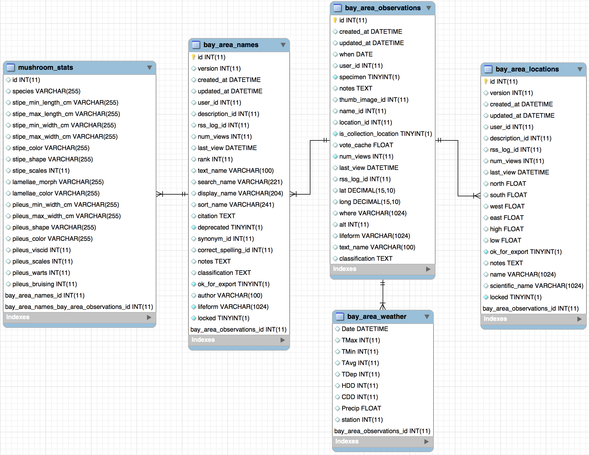

## Technical Report

<b>A predictive classification study of edible wild mushrooms in the greater San Francisco Bay Area</b> 
Chris Huber, chrishubersf@gmail.com

### Project Goal

Given prior records of findings of edible wild edible mushroom species with latitude/longitude coordinates, species names, dates of sightings, weather conditions, and forest compositions can I predict for a given time period and location which species of edible mushroom an instance is likely to be among those that grow natively in the Bay Area?

### Technology Requirements
<ul>
	<li>Python 3.x</li>
	<li>Jupyter Notebook</li>
	<li>MySQL (including Python connector)</li>
	<li>Selenium</li>
	<li>mplleaflet</li>
</ul>

MySQL can be installed using <a href="https://brew.sh">Homebrew</a> or via the <a href="https://dev.mysql.com">MySQL</a> website. Most other packages can be installed using 'pip install {package name}'.

### Data Sources

My main data source for the project is a MySQL database dump from <a href="https://mushroomobserver.org">Mushroom Observer</a>, a user-submitted mushroom documenting website. I filtered those records into Bay Area relevant tables using SQL and wrote queries to extract the data sets I was looking for based on custom criteria. I also sourced weather data for the submitted periods (May 2006 - September 2018) from the NOAA weather website using Selenium. I manually created another table for species-related scientific specifications.

I did a lot of manual looking up of the properties of the mushrooms listed (e.g. edible, poisonous, psychoactive) using Wikipedia, blog posts, and articles published by Bay Area news organizations seeing as that information was not recorded as part of the original dataset. Although time consuming, this research helped me gain some expertise and insight into the field of mycology and the unique habitats and flora specific to the Bay Area.

Late in the project, I used <a href="http://www.mykoweb.com">Mykoweb</a> to glean measurable specifics about the mushroom species I had in my dataset. This was also manually entered but currently exists in database format in my project and as such is primed for additional entries.

In terms of feature engineering, I created an artifical location grid composed of squares 1/4 mile width and length over the observed region and assigned a code to each grid cell to break down the geolocation of each mushroom without using cross-correlated latitude/longitude data. In my research I found that both edible and poisonous mushrooms frequently exist within the same genus (e.g. <a href="https://en.wikipedia.org/wiki/Blusher" target="_blank"><i>Aminita</i> Novinupta</a> vs. <a href="https://en.wikipedia.org/wiki/Amanita_phalloides" target="_blank"><i>Aminita</i> phalloides</a>) and the same environmental conditions. I found a column in my dataset with descriptive wording and also mined that to indicate the presence of forests (Redwood, Coastal Oak, Douglass Fir) as well as other environmental factors (grass, wood chip, duff) that are required or very beneficial for certain mushroom species to grow.

	

### Methods and Models

I am using MySQL as a database backend and Python/Pandas as the main technologies to analyze and deliver my findings. For visualizations, I am using Matplotlib, Seaborn, and Tableau.

Sourcing the data was tricky: the records I was able to find were often partial and the data subject to user error. However, the source is reputable, curated, and well-known one among mycologists and as such I was be able to detect improperly formatted or submitted data with some thorough EDA.

I used Selenium to create an automation script which simulated clicks on the NOAA (National Ocanic and Atmospheric) website in order to scrape weather data for a number of different weather stations. This also required subsequent EDA to account for missing values.

	

<i><a href="https://public.tableau.com/profile/chris.huber#!/vizhome/BayAreaEdibleMushrooms/WeatherConditionsByCluster?publish=yes" target="_blank">interactive version</a></i>

I used the KMeans unsupervised classification algorithm to cluster data which while proving ineffective for classification was useful in assigning weather values. This was significant due to the microclimates that exist in the Bay Area creating conditions where temperature and precipitation can vary greatly over short distances, from San Francisco to Berkeley for example.

	

<i><a href="https://public.tableau.com/profile/chris.huber#!/vizhome/EdibleMushroomsByCluster/EdibleMushroomsByCluster?publish=yes" target="_blank">interactive version</a></i>

### Problematic Factors

One of the issues with this dataset was that mushroom quantity was not recorded, simply occurrences. This means that while mushrooms of the same species typically grow in numbers in a given area, there is no record of how many or how widespread. Data regarding each sample's specifics such as cap size, color, gill shape, etc. were not recorded in anything like a consistent manner either, being occasionally noted in a seperate field which would need to be data-mined or manually examined per record. I was also unable to find data on soil composition which also plays a factor in mushroom growth. I was able to source some information based on user-entered observances but this data was also sporadically entered. Overall, there is a sparsity of data given the time period I am analyzing for: 20689 observations of which 2404 are edible over a 12 year period.

### Statistical Analysis

<b>Model Selection</b> 
To select the best algorithms, I built pipelines to evaluate a number of different models both with and without Standard Scalar and PCA (Principal Component Analysis). The scores I was getting revealed that the best performing model was simple Logistic Regression. Ironically, PCA which I was hoping would reduce noise across hundreds of features actually returned worse results. I attribute this to the fact that many of these columns were dummied which PCA tends to have little effect on. As I add more features to the model, PCA might again become a useful component but not with the current parameters I have to work with.

I then took my top performing models and using the best_estimator_ property of the Pipeline object as a guideline, broke out individual models to test and adjust the hyperparameters on individually since doing an exhaustive analysis of large numbers of parameters with a pipeline is prohibitive both in time and CPU capacity. Doing so resulted in me achieving slightly higher scores for some of my models.

<b>Evaluation</b> 

Based on the results I was getting, it became clear that predicting a mushroom's species using only environmental factors like geolocation and weather was basically impossible. At this point, seeing as I was already using the latitude and longitude of actual previously observed mushrooms, I decided to add more mushroom-related features to my dataset. I randomly generated stipe (stem) and pileus (cap) sizes based on scientifically documented ranges for each species as well as basic morphologies which are also inherent to each species. With these factors added in, my accuracy score jumped to over 98% against my train set and 95% against my test set.

I am anxious to add a broader set of factors in order to analyze my accuracy and false negative rate across a broader set of mushrooms, but also predicting and/or warning about having found poisionous or psychoactive mushrooms. Furthermore, while the current dataset that I have makes methodological prediction of mushroom blooms no better than a guess, the more data that can be sourced the higher the accuracy rate can go so it is not out of the realm of possibility. This project only examines just over 2,400 records (edible only) out of over 20,000 recorded in the Bay Area, so I have more work I can do in the short-term without any additional resources short of further metric gathering and building out of the database.

<b>Inference</b> 
This project serves as a solid proof of concept for mushroom identification, even using imputed data. While mushrooms are extremely difficult to identify just using geolocation or weather factors, they can also be difficult to identify based on shape, color and size and are easily misclassified by an inexperienced observer. However by combining all of these factors including easily observable  metrics, predictions can be made with striking accuracy.

### Future Steps

I envision this project growning into an accompanying database-driven website and phone app. It will require a catalog of species phenomena and an ongoing source of weather data. However, this could both benefit current mycophiles and attract new ones by allowing people to document and identify wild mushrooms that they find at the same time, simply using their phone. The scope is potentially global seeing as mushrooms grow everywhere and have universal characteristics at the species level.

In terms of modeling, my work on this began to suggest more and more the potential of Neural Nets. The fact that they have built-in features to do things like recognize the content of adjoining cells in a grid and its ability to learn from misclassifications by learning using backpropagation made me think that future investigation in this direction is warranted.

