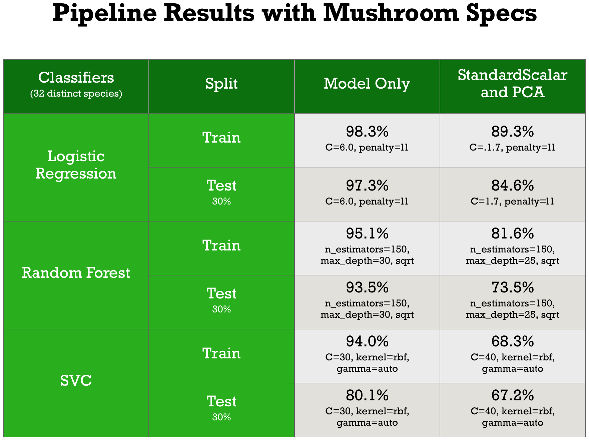

## Technical Summary

A predictive study of edible wild mushroom growth in the greater San Francisco Bay Area 
Chris Huber, chrishubersf@gmail.com

### Problem Statement and Goal

Given prior records of findings of edible wild edible mushroom species with latitude/longitude coordinates, species names, dates of sightings, weather conditions, and forest compositions can I predict for a given time period and location which species of edible mushroom it is among those that grow natively in the Bay Area?

### Data Sources

My main data source for the project is a MySQL database dump from Mushroom Observer, a user-submitted mushroom documenting website. I seperated those records into seperate Bay Area relevant tables using SQL and wrote queries to extract the data sets I was looking for with my chosen filters. I have also sourced weather data for the submitted periods (May 2006 - September 2018) from the NOAA weeather website. 

I also did a lot of manual looking up of the properties of the mushrooms listed (e.g. edible, poisonous, psychoactive) using Wikipedia, blog posts, and articles published by Bay Area news organizations seeing as that information was not recorded as part of the original dataset. Although time consuming, this research helped me gain some expertise and insight into the field of mycology and the unique habitats and flora specific to the Bay Area.

In terms of feature engineering, I created an artifical half mile square location grid and assigned a code to each grid cell to break down the geolocation of each mushroom without using cross-correlated latitude/longitude data. I manually looked up the edibility/poisonous/medicinal/etc. nature of each mushroom species as this information was not supplied in the dataset but is very important. In my research I also found that both edible and poisonous mushrooms exist within the same genus (e.g. <i>Aminita</i> Novinupta vs. <i>Aminita</i> phalloides). I found a column in my dataset with descriptive wording and also mined that to indicate the presence of forests (Redwood, Coastal Oak, Douglass Fir) as well as other environmental factors (grass, wood chip, duff) that are required or very beneficial for certain mushroom species to grow.

### Methods and Models

I am using MySQL as a database backend and Python/Pandas as the main technologies to analyze and deliver my findings. For visualizations, I am using matplotlib and Tableau.

Sourcing the data was tricky: the records I was able to find were often partial and the data subject to user error. However, the source is reputable, curated, and well-known one among mycologists and as such I was be able to detect improperly formatted or submitted data with some thorough EDA.

I used Selenium to create an automation script which simulated clicks on the NOAA (National Ocanic and Atmospheric) website in order to scrape weather data for a number of different weather stations. This also required EDA to account for missing values.

I used KMeans to cluster data which while proving ineffective for classification was useful in assigning weather values. This was significant due to the microclimates that exist in the Bay Area creating conditions where temperature and precipitation can vary greatly over short distances, from San Francisco to Berkeley for example.

### Risks, Assumptions, and Limitations

One of the risks of this dataset was that it does not record quantity, simply occurrences. This means that while the mushrooms of the same species typically grow in a given area, there is no record of the amount. Thus, this should not be seen as a guide to finding any particular amount of a given mushroom but rather its existence in an area.

Limitations became more evident over time. I was unable to find data on very important factors like soil composition which could significantly increase my accuracy scores. There is also a sparsity of data given the time period I am analyzing for (20689 observations (2404 edible) over a 12 year period) which might be shored up if I could gain access to additional and more detailed data.

### Statistical Analysis

<b>Implementation</b> 
I quickly realized that this was a classification problem. As such, I built pipelines to evaluate a number of different models both with and without Standard Scalar and PCA (Principal Component Analysis). The scores I was getting revealed that the best performing models were Logistic Regression without PCA and SVC using PCA. Logistic Regression is a mainstay in classification and predictive modeling while I attribute the success of SVC to the dimensionality splitting capabilities of the RBF kernel which can analyze data in three or more dimensions.

I then took my top performing models and using the best_estimator_ property of the Pipeline object as a guideline, broke out individual models to test and adjust the hyperparameters on individually since doing an exhaustive analysis of large numbers of parameters with a pipeline is prohibitive both in time and CPU capacity. Doing so resulted in me achieving slightly higher scores for some of my models.

<b>Evaluation</b> 

My scores started out very low but gradually improved as I added new data and engineered features. I also soon realized that the goal I was trying to accomplish was extremely ambitious &mdash; 32 different classes for about 2400 observations &mdash; and that the data I had was most likely inadequate for the task at hand. The observations I was using as data were not conducted in a scientific manner and as such would not benefit from things like time series analysis which is often useful in evaluating biological phenomena (because of gestation periods, etc.) However, I did notice my scores improving as I was able to add data which led me to believe that with substrate analysis for specific regions and more accurate reporting of other host vegetation I would be to make more accurate predictions.

Another reality is that mushroom growth, being a biological subject of analysis, is a messy thing to evaluate. There is very significant overlap in species growth and forest compositions are almost always mixed and changing (e.g. fir encroachment into coastal oak forests.) Mushroom identification also relies in large part on factors like stem length, coloration, etc. that were not in a useable format in the data i sourced. I realized at this point that the scope of this project was far greater than the allocated two to three week period but that with more time, data, and research could prove to be a very valuable tool.

<b>Inference</b> 
The fact that I was able to predict even 18.5% of species at an exact level using 32 classifiers is actually fairly amazing given the quality and amount of data I was able to harvest. Using a top-three species prediction using the probabilities reported by the modeling software, I was able to increase this to just under 40%. These numbers in a practical sense would be used as a general guide rather than an exacting analysis tool. However, I could also expand my classifications to include poisionous, medicinial, and psychoactive types and join them with images to provide something like a data-science driven field guide.

### Future Steps

I see a lot of potential in growing this project into a phone-based app of some sort. I envision a user finding a mushroom and using geolocation and date features along with user-supplied mushroom features like gills, latex, stalk and cap features, coloration, and terrain to both submit a new sighting record and receive feedback on the likelihood of it being a certain type of mushroom. With the built-in GPS and photo capabilities of phones, this could provide an easy way to significantly grow the existing database as well as provide interesting and useful feedback to the user. There would be a fun factor too for people looking to test their knowledge of mushroom species and getting immediate feedback based on similar reported sighting pulled from a large database.

In terms of modeling, the more work I did on this, the more it started pointing me in the direction of Neural Nets. The fact that there are built-in Neural Net features to do things like recognize the content of adjoining cells in a grid and its ability to learn from misclassifications made me think that future investigation in this direction is warranted.

In the meantime, a lot more work can be done to source additional data. There is also a lot of missing data for existing rows in my dataset that could be filled in with a more in-depth reworking of the existing data I have. This project is hungry for all the data it can get: by pulling factors like coloration, gills, stem and cap size, and other empirical features that are currently scattered across many different tables and columns a much more specific approach could be used.

